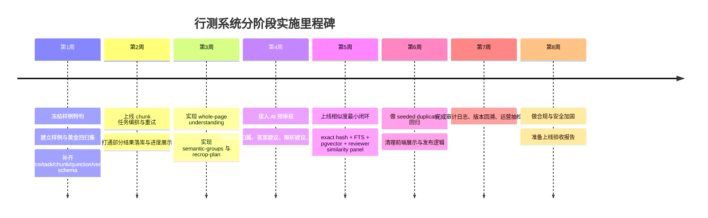

# 行测系统整体设计、撞库策略与 Codex 实施提示词研究报告

## 执行摘要

基于你当前项目的代码路径与既有交付记录，我对这套“行测 PDF 解析 → AI 预审核 → 人工审核 → 发布题库”的系统判断是：**总体方向是对的，但现在最需要从“样例修补型系统”升级为“可治理、可回归、可审计、可去重的生产型系统”**。尤其是你最近暴露出的几个问题——整页题目没有先被 AI 理解就被切碎、图表标题和题干被裁掉、特定页样例回填逻辑侵入业务代码、长任务与 PDF 代理不够稳——都说明当前最优先的不是继续堆提示词，而是把**数据模型、语义重裁切、任务治理、撞库/去重、审核闭环**一次性拉齐。对这类系统，最稳的架构是：**Postgres + pgvector 负责在线业务与近邻检索，S3/MinIO 负责题本与图片资产，NestJS 后端负责任务编排与审核 API，Python pdf-service 负责 OCR/版面/视觉推理，AI 预审核与 recrop-plan 成为中间层一等公民，前端审核工作台同时展示原卷、语义分组、重裁切结果、相似题候选与 AI 结论**。对长任务治理，短期建议优先上 **BullMQ/Redis 的 parent-child chunk flow**，中期若你要跨服务、跨语言做真正的可恢复长工作流，再考虑 **Temporal**；这两类工具都原生支持工作流、重试与状态事件，适合你当前的 NestJS + Python 混合栈。citeturn15view5turn16view0turn16view1turn15view6turn9view6turn15view0turn15view2turn15view4

关于“是否需要对现有历年国省考真题与解析做撞库（相似题/去重）”，结论是：**需要，但必须分层做、分权利边界做，不能把“撞库”理解成无差别收集互联网上所有真题和解析**。最优先应该撞的是**你自有/已授权/用户明确承诺有权上传的题本与解析语料**；对这部分，撞库既能降低重复题污染、也能减少同题多版本解析冲突，还能成为审核工作台的重要提示。对**外部第三方培训机构解析、竞争对手题库、公开网页内容**，在没有授权前不建议做大规模全文入库，更不建议把它们作为自动合并或自动补解析的基础。中国现行著作权法对**汇编作品、汇编权、许可使用、法定许可/合理使用的边界**都规定得比较明确；法定例外非常窄，尤其“学校课堂教学/科研”的例外并不等于你的商业题库可以直接大量复制、发布。再加上近年的生成式 AI、个人信息、网络数据安全规则对数据来源、输入留存、对外委托处理和跨境提供都提出了更明确要求，所以你应把撞库设计成一个**rights-first（先权利后召回）**的能力，而不是一个 recall-first（先多抓再说）的能力。citeturn20view0turn21view2turn23search0turn19view0turn18view0turn22view3turn22view4turn24view0

我给你的最终建议可以浓缩成一句话：**先建立“语义理解后的标准题目”，再做 AI 预审核，再做撞库/去重，再进人工复核与发布；不要在原始 OCR 碎片和错误截图上直接去重。** 从实现顺序看，优先级最高的五件事分别是：  
1. **删除或冻结所有样例特判/页码硬编码逻辑**，特别是你交付记录里已经出现的“第 5 页图表题回填/推导”式写法，改为通用的 whole-page understanding → semantic grouping → recrop-plan。  
2. **补齐不可变源文档、任务分片、题目版本、相似边、审计日志五类核心数据模型**。  
3. **上线在线撞库最小闭环**： exact hash + 规范化文本比对 + pgvector 近邻召回 + 人工确认，不要一上来就全自动合并。  
4. **把 PDF 解析任务改为 parent-child chunk 工作流**，支持逐块重试、进度展示、部分结果落库与前端可见。  
5. **建立合规模块**：来源权利登记、模型调用登记、外部处理委托记录、敏感数据最小化与删除策略。citeturn15view5turn16view0turn19view0turn18view0turn22view3

## 系统蓝图与项目落点

从你提供的上下文看，当前系统已经具备一个明确的三段式雏形：`backend`（NestJS/TypeScript）、`pdf-service`（Python 视觉/OCR/解析）、`admin-web`（审核与预览前端），并且已经在这些路径上出现了关键改造痕迹：`backend/src/modules/pdf/pdf.service.ts`、`pdf-service/vision_ai/prompt_builder.py`、`admin-web/src/views/workbench/ImmersiveWorkbench.vue`；样例文件路径主要包括 `/Users/apple/Downloads/公考/project2/backend/sample-题本篇-3-7.pdf`，长任务样例包括 `/Users/apple/Downloads/公考/project2/pdf-service/题本篇.pdf`。这说明你的基础栈不是“从零设计”，而是要把现有栈**收束成一个明确的 production pipeline**。我建议把整套系统定型为下表所示的六层结构。

| 层级 | 建议主职责 | 主组件/存储 | 关键产物 |
|---|---|---|---|
| 数据层 | 保存源题本、规范题目、图片资产、版本、相似边、审计日志 | Postgres、pgvector、对象存储（S3/MinIO） | `source_documents`、`questions`、`question_versions`、`question_similarity_edges` |
| 解析层 | PDF 标准化、页面渲染、OCR、版面块、整页理解、语义分组、重裁切 | Python `pdf-service` | `page-understanding.json`、`semantic-groups.json`、`recrop-plan.json` |
| AI 预审核层 | 题目完整性判断、图片归属、答案建议、解析建议、风险标签 | 多模态 LLM + 规则融合 | `ai_audit_results.json`、`visual_summary`、`risk_flags` |
| 任务治理层 | 上传、分片、重试、进度、部分结果落库、回调、失败恢复 | NestJS + Redis/BullMQ（短期） | `parse_tasks`、`parse_chunks`、任务 DAG |
| 审核与预览层 | 原卷定位、语义组/预审核/相似题侧栏、移动端预览、人工决策 | admin-web | 审核工作台、回归截图、差异对比 |
| 运维与监控层 | 结构化日志、指标、告警、trace、任务可观测性 | Prometheus/Grafana/Trace/集中日志 | 任务成功率、队列积压、人工驳回率、撞库精度 |

这套分层背后的技术理由是明确的。**pgvector** 已经在 Postgres 内提供了 HNSW 和 IVFFlat 等向量索引：HNSW 查询性能/召回权衡更好但更耗内存，IVFFlat 构建更快、内存更省；同时 PostgreSQL 自带 `tsvector/tsquery`、字段加权和排序函数，非常适合把**全文检索、字段过滤与向量召回**放在同一事务性系统里做在线候选召回。对于更大规模的离线全库聚类与批量近重扫描，**FAISS** 更适合做离线批处理，因为它本身就是为大规模稠密向量相似搜索和聚类设计的。citeturn15view0turn15view2turn15view4turn15view3turn9view6

任务治理方面，短期我更建议你在现有 NestJS 后端上先引入 **BullMQ**：它天然适合 Node 场景，并且支持 **parent-child job flow**、手动/自动重试、事件监听，足以实现“整本 PDF 是父任务、每 3~5 页一个 chunk 是子任务”的模型。BullMQ 文档明确支持 flow 树、失败后重试，并且 NestJS 官方队列能力已经提供了标准事件监听装饰器；这能让你在不推翻当前后端的前提下，快速获得 chunk 状态与 UI 进度。中期如果你发现跨语言状态恢复、长时间 durable execution、历史重放与复杂 saga 越来越重要，再把 orchestration 升级到 **Temporal**，它的核心价值正是“durable, reliable, and scalable workflow execution”。citeturn15view5turn16view0turn16view1turn15view6

你这套系统最关键的设计原则只有两条。第一条是**“先理解，再裁切”**：任何题图/图表题都必须先做整页语义理解，再输出 `semantic-groups` 和 `recrop-plan`，绝不能在原始 OCR 碎块上直接生成最终题目。第二条是**“先权利，再撞库”**：相似度系统只能建立在 rights-cleared corpus（权利明确的题库）之上，否则技术上越强，合规风险越高。后面所有具体建议——Schema、API、提示词、回归测试——都围绕这两条原则展开。

## 数据治理与合规边界

你要做的不是“一个会读 PDF 的脚本”，而是“一个可长期运营的题库系统”。题库系统最容易被忽略、但实际上最决定成败的，是**源数据治理**。我建议把题本来源分成四级：  
**A 级：自有或明确授权源**，例如你购买版权、签署授权、内部自制或自有老师原创内容；  
**B 级：用户上传且在协议中承诺有权使用的源**；  
**C 级：公开可访问但权利状态不明的源**，例如某些公开网页、论坛、培训站点；  
**D 级：明确不应采集或高风险源**，例如竞品付费题库、受限教材/讲义、第三方解析合集。  
系统只应允许 A/B 进入**正式知识底座与撞库底座**；C 级最多进入“待法务确认/仅做人工核验参考”，D 级默认拒绝。这样分层的原因并不是保守，而是中国现行规则对**作品、汇编作品、许可使用、输入数据与个人信息**都已给出比较明确的边界：汇编本身可能形成新的权利对象；正常经营中使用他人作品通常需要许可；合理使用与教科书法定许可范围都很有限；个人信息处理要满足合法、正当、必要与最小范围原则；委托第三方处理、跨境提供和对外提供/委托处理数据都需要额外制度动作。citeturn21view2turn20view0turn19view0turn18view0

版权与合规上，最容易出问题的不是“真题四个选项”，而是**整套真题的选编、版式、图表、配图、解析文本、知识点总结、题库数据库化后的组织结构**。著作权法明确规定：对“若干作品、作品片段或者不构成作品的数据或者其他材料”进行具有独创性的选择、编排可以构成**汇编作品**；同时著作权中本身就包含**汇编权**。另外，商业性使用他人作品，原则上应当订立许可使用合同；法定例外里的“个人学习、研究或者欣赏”“介绍、评论中的适当引用”“学校课堂教学/科研中的少量复制且不得出版发行”都不是你这个题库系统的当然豁免。尤其值得注意的是，法院系统已经把“教辅材料中适当引用的判定标准”作为典型问题公开提示，这意味着**不要把“教育用途”误解成“商业题库可自由复制”**。citeturn21view2turn20view0turn23search0

因此，我建议你把**来源元数据与权利元数据**作为所有表的前置字段，而不是附件信息。每个 `source_document` 至少要有：`source_type`、`rights_status`、`rights_owner`、`license_scope`、`warranty_source`、`allowed_use`、`retention_policy`、`takedown_contact`、`ingest_operator`、`ingest_reason`。每个题目版本也要保留 `source_document_id`、`source_page_span`、`source_crop_refs`、`parse_version`、`prompt_version`、`reviewer_id`。这不是官僚主义，而是为了回答三个关键问题：**这题从哪来、你凭什么能用、它是怎么变成现在这个版本的**。

题本标准化流程建议做成一个状态机，而不是散落在若干 API 里：  
`uploaded → virus_scanned → rights_checked → normalized_pdf → page_rendered → page_understood → semantic_grouped → recropped → preaudited → similarity_checked → human_reviewed → published / quarantined / rejected`。  
其中 `rights_checked` 必须在进入正式解析前完成最少字段校验；`similarity_checked` 必须在 `recropped + preaudited` 之后再做；`published` 只能发生在 review 结论明确以后。对用户上传文件，协议侧还要配合：系统层面需要要求上传者确认其拥有相应使用权；如果你把题本交给外部模型/OCR 商处理，PIPL 与网络数据安全规则要求你对委托处理做合同约定、监督、记录保存，并在必要时对跨境提供进行评估与告知。citeturn19view0turn18view0turn5search3turn5search11

再说生成式 AI 合规。你这个系统如果只在内部审核工作台中使用，不向境内公众提供生成式服务，那么《生成式人工智能服务管理暂行办法》对“面向公众服务”的一些义务未必直接适用；但一旦你把 AI 生成功能外放给公众、考生或外部客户，相关服务规范、输入保护、内容标识、部分场景的备案/公示要求就要认真对照。办法明确要求服务提供者：使用**合法来源**的数据和基础模型、不得侵害知识产权、涉及个人信息应有合法基础、提高训练数据质量、保护输入信息和使用记录、不得收集非必要个人信息；2025 年出台的《人工智能生成合成内容标识办法》又进一步把显式/隐式标识写得更细。换言之，对你这种题库系统，最稳的做法是：**即使内部用，也把 AI 生成字段统一打上 internal-AI 标签；如果将来对外展示 AI 解析、AI 总结，则预先按可公开标识的要求设计数据结构和 UI**。citeturn24view0turn22view3turn22view4turn9view4turn9view3

## 撞库策略与相似度方案

### 为什么一定要做撞库

对行测题库，撞库不是锦上添花，而是**质量控制的主能力之一**。不做撞库，你会同时遇到四类问题：  
一是同一道历年真题在不同题本、不同 OCR 结果、不同截图版本中被重复入库；  
二是同题不同解析互相冲突，运营人员很难知道哪一版是 canonical 版；  
三是材料题/资料分析题极容易因为题干缺块、选项顺序、图表碎片而误判为新题；  
四是外部来源内容混入后，你无法及时知道“这题可能已经在你库里”或“这段解析可能来自未知外部来源”。  
因此，**撞库的首要目标不是“把库做大”，而是“保证同一道题在系统里只有一个可追溯 canonical 身份”**。技术上，撞库应该服务三个动作：`dedupe（去重）`、`link（关联同源/变体）`、`warn（相似性提示）`；业务上，撞库应该服务三个阶段：`入库前拦截`、`审核中辅助`、`发布后巡检`。

### 什么时候做撞库

我建议把撞库放在三个时点，但**不要在原始 OCR 结果上直接做最终判定**：

1. **轻撞库**：在 `page_understanding` / `semantic_grouping` 之后，先做一次**低成本候选召回**，目的只是告诉 AI 和人类：“这页疑似已有相似题/相似材料”。  
2. **主撞库**：在 `recrop + question synthesis + ai preaudit` 之后，对**标准化题目对象**做正式相似度决策，这是主判定点。  
3. **发布后巡检**：对新增题与历史全库做离线批处理，更新 duplicate cluster、相似题簇和运营报表。

也就是说，你真正要撞的是“**标准化题目**”，而不是“原始 OCR 文本块”。如果在碎块阶段就自动合并，很容易把题干残缺的错题和完整旧题误认为一题，反而污染 canonical 数据。

### 建议的分层阈值

下面给的是**初始工程阈值**，不是法定标准。上线前必须用你自己的标注集校准。建议最少做一个 **500–1000 对题目 pair** 的金标集，按题型分层校准（文字题、图表题、材料题分别校）。

| 判定层级 | 建议条件（初值） | 系统动作 | 人工复核 |
|---|---|---|---|
| 精确重复 | `exact_hash` 相同；或 `stem_norm + options_norm + answer_norm` 全相同 | 自动标记 `exact_duplicate`，默认不重复发布 | 抽检 5% |
| 高置信近重 | `text_emb_cos ≥ 0.97` 且 `structure_score ≥ 0.95`；图像题再加 `image_hash_distance ≤ 5` 或相同 `visual_group_hash` | 不自动发布到正式库，进入 merge review | 100% |
| 中置信近重 | `0.93 ≤ text_emb_cos < 0.97` 且结构/答案高度接近 | 仅显示“疑似重复/变体”候选，不自动合并 | 100% |
| 材料同源 | 材料文本或图表高度相似，但子题题干不同 | 标记 `sibling_under_same_material` | 仅抽检 |
| 主题相似 | `0.85 ≤ text_emb_cos < 0.93` | 只作相似题推荐，不参与去重 | 不必逐题复核 |

这些阈值之所以要分层，不只是为了精度，更是为了合规。对**exact duplicate**，业务上几乎总能接受自动压制；对**near duplicate**，你往往需要人来判断“这是 OCR 变体、编辑改写，还是同考点不同题”。尤其是资料分析和图表题，材料相同但子题不同的情况极多，不能只看 embedding 分数。

### 相似度技术路线

最稳妥的技术路线是**级联检索 + 多特征重排 + 图决策**：

1. **规范化与精确哈希**  
   先生成 `stem_norm`、`options_norm`、`analysis_norm`、`exact_hash`、`loose_hash`。  
   `norm` 层建议做：全半角统一、空白/标点归一、中文数字与阿拉伯数字统一、年份格式统一、选项标签标准化、去掉 OCR 噪声 token。  
   这一层负责“能用哈希解决的就别上向量”。

2. **候选召回**  
   在线用 PostgreSQL 全文检索 + pgvector：  
   - `tsvector` 检索负责精确词项和短语；  
   - `embedding` 检索负责语义近邻；  
   - 过滤条件放在 `exam_year / province / module / question_type / rights_scope` 上。  
   PostgreSQL 官方文档明确支持 `tsvector/tsquery`、字段加权和 rank；pgvector 则可用 HNSW 或 IVFFlat 进行 ANN 检索。citeturn15view4turn15view3turn15view0turn15view2

3. **文本语义相似**  
   对召回候选计算：  
   - `embedding cosine`  
   - `char/word ngram Jaccard`  
   - `Levenshtein/编辑距离`  
   - `option set match`  
   - `answer consistency`  
   Sentence Transformers 的 STS 用法本质就是“对文本生成 embedding 后再计算相似度”，非常适合作为这层骨架。中文向量模型建议优先考虑 **BGE-M3** 或 **BCE**：前者支持 dense / sparse / multi-vector 并能处理长文本；后者对中英双语和 RAG 场景更友好。citeturn17view0turn10view0turn10view1turn10view2turn10view3

4. **图像/图表相似**  
   对图片题不要只比文字。建议至少保留三类图像特征：  
   - `pHash / blockMeanHash`：处理近似保存、轻微缩放、轻度裁切；  
   - 图像 OCR 的标题/图例文本向量；  
   - `visual_group_hash`：把合并后完整图表作为单位，而不是碎片图。  
   OpenCV 官方 `img_hash` 模块就提供了 pHash、block mean hash 等算法，并明确定位为“大规模图片近似比对”的快速手段。citeturn17view1turn17view2

5. **结构化比对与重排**  
   在文本分数之上，再算一层结构分：  
   - 题型是否相同  
   - 选项数是否相同  
   - 选项标签是否仅重排  
   - 材料组/母题是否相同  
   - 图表标题是否一致  
   - 数值表是否一致  
   这一步对资料分析题尤为关键。

6. **决策与聚类**  
   在线流程对 pair 做 `edge_type` 判定：`exact_duplicate / near_duplicate / sibling / topical_similar / unrelated`。  
   离线流程再把 `exact + high-confidence near` 通过 `union-find` 合并成 duplicate cluster，选出 `canonical_question_id`。  
   如果你要做更高级的主题簇，也可以在相似图上聚类，但这不是第一阶段必需品。

### 方法比较表

| 方法 | 优点 | 缺点 | 最适合的阶段 |
|---|---|---|---|
| 规范化哈希 | 快、稳定、可解释 | 对 OCR 噪声和改写不鲁棒 | 精确去重第一层 |
| FTS / BM25 / `tsvector` | 对短词项、年份、专有词很强，可直接过滤 | 对同义改写一般 | 候选召回 |
| 文本 embedding | 能抓语义改写、选项重组 | 需要阈值校准，易把同主题误判成同题 | 候选召回 + 重排 |
| 图像 hash | 对相同图表变体很有效 | 对大幅裁切、标题缺失不稳 | 图表题第一层 |
| 多模态 LLM 比对 | 能看懂文本+图表+结构 | 成本高、解释需约束 | 中高风险复核 |
| 人工复核 | 最可靠 | 成本高 | 高风险最终判定 |

这里要强调一个关键边界：**“撞库现有历年国省考真题”与“撞库第三方解析”不能一视同仁。** 对解析文本，你应当单独建立 `analysis_similarity` 索引与规则，因为解析的原创性通常高于四选一题干本身。我的建议是：  
- 对**自有/授权解析**：允许以撞库结果为依据做自动推荐与复用；  
- 对**外部未授权解析**：只做相似性提醒，不做自动复用，也不把外部解析直接吸纳为 canonical explanation。  
这样做的原因，是解析文本更容易落入著作权保护的“表达”层；而著作权法对汇编作品和许可使用也要求你不要把“只做技术相似性”误当成“当然可以大规模使用”。citeturn21view2turn20view0

## AI 预审核、语义重裁切与数据库 API 设计

### 先理解再裁切，撞库才能可信

你最近遇到的“一张图被切成多张、图表标题被裁掉、题干缺失”，本质上告诉我们：**如果没有先完成整页理解，撞库结果也不可信。** 因此主流程应重排为：

`source upload`  
→ `page rendering`  
→ `whole-page understanding`  
→ `semantic grouping`  
→ `recrop-plan`  
→ `question synthesis`  
→ `AI pre-audit`  
→ `similarity check`  
→ `human review`  
→ `publish`

这里最关键的新中间产物有四个：  
- `page-understanding.json`：整页题号、块、跨页候选、视觉碎裂候选  
- `semantic-groups.json`：题干组、选项组、visual group、title group、legend group  
- `recrop-plan.json`：必须二次裁切的区域、padding、必须保留的标题/图例/坐标轴/表头  
- `similarity-report.json`：候选题、各分项分数、系统建议与 reviewer action

只有在 `recrop-plan` 执行之后，你才有资格说“这道题是用于撞库和预审核的标准对象”。

### 在 AI 预审核阶段接入撞库

我建议把撞库真正接到 AI 预审核阶段，而不是后置孤岛服务。也就是说，AI 预审核不仅要给出：

- 题目是否完整  
- 图片/图表是否归属正确  
- 是否能作答  
- 答案建议  
- 解析建议  
- 风险标签

还要额外给出：

- 已有题库中的 top-k 相似题  
- 相似原因（题干近似、图表相同、选项仅重排、材料相同）  
- 建议动作（merge / sibling / ignore / needs human compare）  

这样，前端审核员看到的就不是单个孤立题，而是“**这题 + 原卷 + AI 解释 + 相似候选**”的完整判断上下文。对于资料分析题，这个设计极其有价值：如果新题 OCR 丢了一个标题，而旧题库里正好有同一张完整图表，系统可以提示 reviewer 去核验 recrop 是否缺关键区域；但请注意，这仍然应当是**提示**，不是自动替换。

### 数据库表设计要点

下面是建议的核心数据模型。为了兼顾性能与审计，我建议采用“主表 + 版本表 + 边表 + 事件表”的组合，而不是把所有历史都堆进 `questions` 主表。

| 表 | 作用 | 关键字段 |
|---|---|---|
| `source_documents` | 不可变源题本登记 | `source_type` `rights_status` `sha256` `object_path` `exam_year` `province` |
| `parse_tasks` | 解析任务 | `task_id` `source_document_id` `pipeline_version` `status` `progress` |
| `parse_chunks` | 分片状态 | `task_id` `chunk_no` `page_start` `page_end` `status` `attempts` `error` |
| `page_artifacts` | 页面中间产物 | `page_no` `render_path` `ocr_json` `layout_json` `page_understanding_json` |
| `materials` | 材料/母题 | `material_id` `pages` `text` `images` `material_hash` |
| `questions` | 当前 canonical 视图 | `question_id` `canonical_question_id` `material_id` `stem` `options` `answer` `analysis` |
| `question_versions` | 版本快照 | `version_no` `snapshot_json` `editor_type` `change_reason` `prompt_version` |
| `question_assets` | 图片/图表/裁切资产 | `asset_id` `question_id` `asset_type` `page_no` `bbox` `object_path` `visual_hash` |
| `question_similarity_edges` | 相似边 | `src_question_id` `dst_question_id` `edge_type` `score_json` `decision_status` |
| `review_actions` | 人工决策 | `question_id` `reviewer_id` `action` `note` `before` `after` |
| `audit_events` | 审计日志 | `entity_type` `entity_id` `event_type` `payload` `actor` |

你特别提到的 `question schema`、`image linkage`、`ai_audit` 字段，我建议至少有下面这些核心字段：

```json
{
  "question_id": "uuid",
  "canonical_question_id": "uuid|null",
  "source_document_id": "uuid",
  "material_id": "uuid|null",
  "exam_year": 2021,
  "province": "国考-副省级",
  "module": "资料分析",
  "question_no": "94",
  "source_page_start": 5,
  "source_page_end": 5,
  "stem": "......",
  "stem_norm": "......",
  "options": [
    {"label":"A","text":"2018年"},
    {"label":"B","text":"2019年"},
    {"label":"C","text":"2020年"},
    {"label":"D","text":"2021年"}
  ],
  "options_norm": ["2018年","2019年","2020年","2021年"],
  "answer": null,
  "analysis": null,
  "question_type": "single_choice_chart",
  "has_visual_context": true,
  "images": [
    {
      "asset_id": "uuid",
      "page": 5,
      "bbox": [0,0,100,100],
      "image_role": "chart",
      "belongs_to_question": true,
      "linked_by": "ai|layout|hybrid|human",
      "link_reason": "题干询问收入比，图表标题与年份字段一致",
      "visual_hash": "phash:...."
    }
  ],
  "visual_parse_status": "success|partial|failed",
  "visual_summary": "......",
  "visual_confidence": 0.82,
  "answer_suggestion": "D",
  "answer_confidence": 0.82,
  "answer_unknown_reason": null,
  "analysis_suggestion": "......",
  "analysis_confidence": 0.78,
  "analysis_unknown_reason": null,
  "ai_audit_status": "passed|warning|failed|skipped",
  "ai_audit_verdict": "可通过|需复核|不建议入库",
  "ai_audit_summary": "......",
  "ai_reviewed_before_human": true,
  "risk_flags": ["图表数值来自OCR识别，建议复核"],
  "duplicate_status": "none|exact|near|sibling|similar",
  "duplicate_cluster_id": "uuid|null",
  "publish_status": "draft|review|published|rejected"
}
```

这里面的 `question_versions` 必须做成**append-only**，不要只在主表原地覆盖。因为你的系统既有 AI 自动修改，也有人工复核和后续校正；一旦没有版本，你就无法解释“这个答案建议是谁改的，为什么变了”。而且从合规角度看，网络数据安全规则与个人信息规则都越来越强调**责任可追溯、处理规则公开、受托处理可监督、日志和记录保留**。citeturn18view0turn19view0

### API 设计要点

围绕上面这些表，建议最小 API 集合如下：

- `POST /admin/source-documents` 上传并登记源题本  
- `POST /admin/parse-tasks` 创建解析任务  
- `GET /admin/parse-tasks/:taskId` 查看整体进度  
- `POST /admin/parse-tasks/:taskId/retry-chunks` 重试失败分片  
- `GET /admin/questions/:questionId` 获取题目完整对象  
- `GET /admin/questions/:questionId/versions` 查看版本历史  
- `GET /admin/questions/:questionId/similarity` 查看相似候选  
- `POST /admin/questions/:questionId/review-action` 执行 merge / split / keep-both / reject  
- `POST /admin/questions/:questionId/override-ai` 人工覆盖 AI 结论  
- `POST /admin/publish-result` 批量发布，但只允许对 `reviewed & rights_ok & duplicate_resolved` 的题目发布

同时，`publish-result` 不应再只是一个“一把梭”式同步请求，而要支持：  
- **部分发布**  
- **跳过 unresolved duplicate**  
- **保留 review queue**  
- **输出 decision summary**  

这会让你后续的运营与回归测试清晰得多。

## Codex 提示词、Playwright 断言与回归基线

### 提示词模板总体建议

对 Codex，这类项目最怕的不是“不会写代码”，而是**没被约束成正确的工作对象、正确的 debug 产物和正确的验收口径**。所以提示词一定要同时规定：

- 当前项目路径与样例输入  
- 禁止事项（不得继续硬编码样例页面、不得只修前端显示）  
- 必须输出的中间产物  
- 必须跑的 Playwright 断言  
- 必须保留的回归基线  
- 最终交付报告格式

我建议把你发给 Codex 的提示词分成三类：**快速诊断版、修复实现版、验收回归版**。三者不是重复，而是分别解决“先找根因”“再动代码”“最后证明没回归”的问题。

### 提示词模板对比表

| 模板 | 适用时机 | 关键输入 | 期望输出 | 必要 debug 产物 | Playwright 断言 | 回归基线 |
|---|---|---|---|---|---|---|
| 快速诊断版 | 现象多、方向不明时 | 样例 PDF、当前报错页面、最近失败 taskId | 根因列表、可复现步骤、影响文件、是否有样例特判 | logs、API dump、DOM dump、截图 | 页面能复现问题，定位遮罩/PDF proxy/未完成状态 | 现有样例不改代码复现 |
| 修复实现版 | 已知方向后进入开发 | 项目根路径、目标架构、禁止事项 | 修改文件清单、设计说明、可运行服务、产物路径 | `page-understanding` `semantic-groups` `recrop-plan` `similarity-report` | 题干/图表/相似候选/AI 结论可见 | `sample-题本篇-3-7.pdf` + 非第5页图表题 |
| 验收回归版 | 合并前最后一次 | 指定 taskId、bankId、黄金样本、截图目录 | 验收表、逐题结果、风险项、未解决项 | API 返回、数据库快照、trace、视觉对比 | 不出现 placeholder；各题状态完整；可逐题遍历 | 黄金样本 + seeded duplicate bank + 长任务前3 chunk |

### 快速诊断版提示词模板

```text
你是本项目的诊断 Agent。不要先改代码，先做“根因定位”。

项目根路径：
/Users/apple/Downloads/公考/project2

当前重点样例：
1. /Users/apple/Downloads/公考/project2/backend/sample-题本篇-3-7.pdf
2. 如需长任务样例，再用 /Users/apple/Downloads/公考/project2/pdf-service/题本篇.pdf

已知现象（按我最新描述为准，不要沿用旧会话结论）：
- 图表被切碎
- 图表标题/表头被裁掉
- 题干可能缺失
- 某些题 AI 预审核显示未完成/0%
- 历史上曾出现 visual parse unavailable
- 不排除存在样例页特判逻辑
- 可能存在 PDF proxy 500、前后端数据源不一致、review 页与 API 不一致

你的任务：
1. 只做复现、定位、取证，不做功能重构。
2. 用 API + 页面 + 日志三重方式定位根因。
3. 检查是否存在 page 5 / 特定题号 / 特定 bankId / 特定 answer 的硬编码。
4. 检查是否存在“先切图后识别”链路导致的碎图/缺标题/缺题干。
5. 检查 AI 预审核字段是否真的在后端生成，还是前端临时拼装。
6. 检查 PDF proxy 参数、文件映射、临时文件生命周期。
7. 给出“最小修复面”，按优先级排序。

必须输出：
- 根因清单（按严重度排序）
- 影响范围
- 涉及文件路径
- 哪些现象是显示层 bug，哪些是识别链路 bug，哪些是任务治理 bug
- 是否存在样例特判/硬编码

必须保存 debug 到：
debug/diagnosis/<taskId or timestamp>/
其中至少包括：
- api-dump.json
- dom-dump.json
- failing-network.json
- candidate-hardcode-search.txt
- screenshots/*.png
- playwright-trace.zip

Playwright 必须断言：
- 能复现当前问题
- 能截到问题区域
- 能输出实际看到的错误文本或缺失要素
- 不能只说“已保存截图”

最终只输出：
1. 根因报告
2. 影响文件清单
3. 建议修复顺序
不要直接开始重构。
```

### 修复实现版提示词模板

```text
你是本项目的全权开发 Agent。现在开始做“语义优先”的识别链路重构，不要再沿用“先切图再识别”的思路。

项目根路径：
/Users/apple/Downloads/公考/project2

必须优先使用的样例：
- /Users/apple/Downloads/公考/project2/backend/sample-题本篇-3-7.pdf
- 重点检查图表题与非图表题各至少一页
- 如果需要长任务机制验证，可额外用 /Users/apple/Downloads/公考/project2/pdf-service/题本篇.pdf，但本次不是为了解决整本 188 页超时

目标：
1. 整页理解（whole-page understanding）
2. 语义分组（semantic grouping）
3. 二次裁切（semantic re-cropping）
4. AI 预审核
5. 相似题/去重提示
6. 人工审核前即能看到完整题目与风险结论

禁止事项：
- 不得继续写 page 5 特判、题号特判、bankId 特判
- 不得只在前端隐藏错误占位符
- 不得在碎图/缺题干状态下直接生成最终题目
- 不得把未授权外部解析直接作为 canonical 解析
- 不得把 withImages > 0 当作通过标准

必须修改或补齐的能力：
A. 解析链路
- page_understanding
- semantic_groups
- recrop_plan
- material/question synthesis

B. AI 预审核
- images linkage
- visual summary
- answer suggestion
- analysis suggestion
- ai_audit_status/verdict
- risk_flags

C. 相似性
- exact hash
- normalized text compare
- pgvector candidate retrieval
- similarity report for reviewer
- duplicate / sibling / similar 分类

D. 任务治理
- 至少支持 chunk state, retry, partial save

E. 前端审核
- 左侧原卷
- 中间语义/AI 审核区
- 右侧预览
- 相似题侧栏
- merge/split/ignore 动作入口

必须输出的 debug 产物：
debug/pdf-semantic/<taskId>/
- page-understanding.json
- semantic-groups.json
- recrop-plan.json
- ai-audit-results.json
- similarity-report.json
- final-questions.json
- final-preview-payload.json
- api-responses.json
- playwright/*.png
- trace.zip

Playwright 必须断言：
1. 页面中不再出现 visual parse unavailable / undefined / [object Object]
2. 图表标题可见
3. 题干完整
4. 图表不再碎片化
5. AI 预审核状态明确
6. 可看到答案建议或明确失败原因
7. 可看到解析建议或明确失败原因
8. 可看到“疑似重复/相似题”区域
9. review 页面与 API 返回一致

最终交付只输出：
- 修改文件清单
- 新链路说明
- 样例题 JSON 摘要
- 相似性判定样例
- Playwright 证据
- 仍未解决问题
```

### 验收与回归版提示词模板

```text
你是本项目的验收 Agent。不要继续写新功能，只做“验收与回归”。

项目根路径：
/Users/apple/Downloads/公考/project2

回归基线：
1. sample-题本篇-3-7.pdf
2. 一页图表题（非 page 5）
3. 一页纯文字题
4. 一组材料题/多子题
5. 一组 seeded duplicate bank（请你自己构造或利用已有测试数据）
6. 长任务只验证前 3 个 chunk 的状态推进与重试，不要求跑完整本

必须检查：
A. API
- task create / chunk status / retry
- question payload
- ai_audit fields
- image linkage
- similarity candidates
- duplicate status
- versions / audit trail

B. 页面
- 左侧 PDF/原卷可打开
- 中间审核区字段完整
- 右侧预览与中间一致
- 相似题侧栏正确展示
- 不重复、不缺题干、不缺标题、不碎图

C. 数据
- exact duplicate 是否未重复发布
- near duplicate 是否进入 review
- canonical_question_id / duplicate_cluster_id 是否一致
- versioning / audit trail 是否有记录

必须保存：
debug/regression/<taskId or timestamp>/
- regression-matrix.json
- per-case-api.json
- per-case-ui.json
- screenshots/*.png
- traces/*.zip

Playwright 必须逐题断言：
- 原卷可见
- visual placeholder 不存在
- AI 状态明确
- similarity 提示存在或明确为空
- 标题/题干完整
- 截图成功保存
- 若失败，输出具体 selector、文本和截图

最终输出：
1. 回归矩阵
2. 通过/失败案例
3. 新旧差异
4. 上线风险
5. 是否允许合并
```

### 推荐的 Playwright 断言片段

Playwright 官方支持保存截图、全页截图以及 `toHaveScreenshot()` 视觉断言；还支持 Trace Viewer，适合把你的审核页问题做成可复用证据。citeturn16view2turn16view3turn0search3

```ts
import { test, expect } from '@playwright/test';

test('图表题应显示完整题干、完整图表与相似题提示', async ({ page }) => {
  await page.goto('http://localhost:5177/workbench?bankId=YOUR_BANK_ID');

  // 不允许出现错误占位符
  await expect(page.locator('body')).not.toContainText('visual parse unavailable');
  await expect(page.locator('body')).not.toContainText('[object Object]');
  await expect(page.locator('body')).not.toContainText('undefined');

  // AI 预审核状态
  await expect(page.getByTestId('ai-audit-status')).toContainText(/已完成|需复核|失败/);

  // 题干必须存在
  await expect(page.getByTestId('question-stem')).not.toHaveText('');

  // 图表标题必须可见（按你的页面真实 selector 调整）
  await expect(page.getByTestId('visual-title')).toBeVisible();

  // 相似题侧栏
  await expect(page.getByTestId('similarity-panel')).toBeVisible();

  // 证据截图
  await page.screenshot({
    path: 'debug/regression/current/question-preview.png',
    fullPage: true,
  });
});
```

### 推荐的回归基线

建议你把下面这些样例固化为长期基线，而不是每次临时找新文件：

| 基线编号 | 目的 | 样例建议 |
|---|---|---|
| R0 | 小样本全链路 | `sample-题本篇-3-7.pdf` |
| R1 | 图表题非 page 5 泛化 | 从长 PDF 另截 1–2 页图表题 |
| R2 | 纯文字题 | 样例 PDF 的文字页 |
| R3 | 材料题/多子题 | 共享材料 + 多题 |
| R4 | 重复题种子库 | 事先插入同题多版本 |
| R5 | 长任务治理 | `题本篇.pdf` 前 3 个 chunk |

## 运营复核、里程碑与验收标准

### 人工复核策略

你这个系统最终不会完全无人审，所以运营策略的目标不是“消灭人工”，而是**把人工用在最值钱的地方**。我建议按风险分层：

| 风险层 | 触发条件 | 人工复核比例 |
|---|---|---|
| 高风险 | 图表缺失/标题缺失/题干不完整/near duplicate/rights unknown | 100% |
| 中风险 | AI `warning`、答案建议低置信、解析建议低置信 | 100% |
| 低风险 | 纯文字题、AI `passed`、无相似冲突 | 上线初期 20%，稳定后 5%–10% |
| 自动压制样本 | exact duplicate | 抽检 5% |

审核界面建议固定包含以下元素：  
- 左侧：原卷 PDF / page overlay / bbox 高亮  
- 中间：题干 + 选项 + AI 状态 + 风险原因 + recrop 结果  
- 右侧：移动端/最终预览  
- 右侧侧栏或下栏：相似题候选、分数、差异高亮  
- 底部：merge / split / keep-both / mark-sibling / reject / publish  
- 历史：版本变化、审计记录、来源权利标签

这会让审核员从“人工猜题”转到“人工判决系统建议”。

### 纠错闭环

要让系统越来越准，必须把人工纠错回流成训练/规则资产，而不是一次性操作。建议每周固定产出三类样本集：

1. **解析金标集**：题干完整/不完整、图表归属对/错、答案建议对/错  
2. **相似度金标集**：exact / near / sibling / unrelated  
3. **前端验收金标集**：页面可视化缺陷、预览缺失、相似题误导

这些样本不一定拿去微调大模型，但至少要拿去**校准阈值、更新 prompt、回归测试**。如果不建立闭环，你会不断重复今天的 bug。

### 实施里程碑

下面给你一个适合当前项目的**六周到八周**里程碑。时间可以调整，但顺序不要乱。



### 分阶段交付表

| 里程碑 | 交付物 | 核心验收标准 |
|---|---|---|
| M0 基线冻结 | 黄金样本、失败截图、问题清单 | 能稳定复现旧问题 |
| M1 数据模型 | source/task/chunk/question/version/similarity schema | 可追溯、可增量 |
| M2 任务治理 | chunk 流程、重试、进度、partial save | 长任务不再靠单个 30 分钟阻塞请求 |
| M3 语义重裁切 | `page-understanding` `semantic-groups` `recrop-plan` | 不再碎图、不再丢标题/题干 |
| M4 AI 预审核 | ai_audit、answer/analysis suggestion、risk flags | 人工审核前已有 AI 结论 |
| M5 撞库闭环 | 相似候选、duplicate cluster、canonical 逻辑 | 重复题不再重复发布 |
| M6 前端与运营 | similarity panel、merge/split、审计记录 | 审核界面可闭环决策 |
| M7 合规加固 | rights ledger、外部处理记录、删除策略 | 可应对法务与投诉追溯 |

### 总体验收清单

只有同时满足下面这些点，才应视为“可以进入稳定迭代阶段”：

- 样例小 PDF 可全链路通过  
- 非 page 5 图表题也能通过  
- 不再存在样例页特判  
- chunk 任务可重试、可恢复、可部分落库  
- 审核页不出现 placeholder / 碎图 / 缺标题 / 缺题干  
- AI 预审核与页面展示字段一致  
- 相似题候选可见且可人工决策  
- exact duplicate 不重复发布  
- `question_versions` 与 `audit_events` 可追溯  
- rights metadata 与模型调用记录可追溯  
- Playwright 与 API 回归能固定复现/证明结果

## 直接可发给 Codex 的最终提示词

下面这版可以直接作为你下一轮实现的启动提示词。它已经把**项目路径、目标架构、禁止事项、交付物、回归要求**压缩到了一页可执行文本里。

```text
你是本项目的全权开发 Agent。当前项目根路径为：

/Users/apple/Downloads/公考/project2

当前栈：
- backend：NestJS/TypeScript
- pdf-service：Python
- admin-web：审核前端

重要说明：
不要沿用旧会话的结论，也不要继续在 backend/src/modules/pdf/pdf.service.ts 里写 page 5 / 特定题号 / 特定答案的样例特判。当前任务是把系统从“先切图再识别、按样例修补”升级为“先整页理解、再语义重裁切、再 AI 预审核、再相似题提示、再人工审核”的通用链路。

优先样例：
1. /Users/apple/Downloads/公考/project2/backend/sample-题本篇-3-7.pdf
2. 如需验证 chunk 机制，可额外使用 /Users/apple/Downloads/公考/project2/pdf-service/题本篇.pdf，但本次不是为了跑完整本 188 页

必须实现的目标：
1. Whole-page understanding：AI 先看整页，判断题号、题干、选项、图表、图表标题、图例、表头、脚注、跨页关系
2. Semantic grouping：每道题输出 stem_group / options_group / visual_group / title_group / notes_group
3. Recrop plan：根据语义结果重新裁切，必须保留题干、图表完整体、图表标题、图例、坐标轴、表头
4. AI pre-audit：在人工审核前生成 ai_audit_status / ai_audit_verdict / answer_suggestion / analysis_suggestion / risk_flags
5. Similarity hint：对标准化后的题目做 exact hash + normalized compare + pgvector 相似召回，输出 duplicate / near / sibling / similar 候选
6. Review UI：左侧原卷、中间 AI 审核区、右侧预览、相似题侧栏，支持 merge / split / keep-both / ignore
7. Task governance：解析任务支持 chunk state、retry、partial save，不允许整本 PDF 继续依赖单个阻塞式长请求

禁止事项：
- 不得继续写 page 5 / bankId / questionId / answer=D 特判
- 不得只在前端隐藏 visual parse unavailable
- 不得在题干不完整、标题缺失、碎图状态下直接生成最终题目
- 不得把未授权外部解析直接写入 canonical 题库
- 不得以 withImages > 0 作为通过标准

必须落库/暴露的核心字段：
- image linkage
- visual_parse_status / visual_summary / visual_confidence
- ai_audit_status / ai_audit_verdict / ai_audit_summary / ai_reviewed_before_human
- answer_suggestion / answer_confidence / answer_unknown_reason
- analysis_suggestion / analysis_confidence / analysis_unknown_reason
- duplicate_status / duplicate_cluster_id / similarity candidates
- question_versions / audit_events

必须输出的 debug 产物：
debug/pdf-semantic/<taskId>/
- page-understanding.json
- semantic-groups.json
- recrop-plan.json
- ai-audit-results.json
- similarity-report.json
- final-questions.json
- final-preview-payload.json
- api-responses.json
- playwright/*.png
- trace.zip

Playwright 必须断言：
1. 页面中不存在 visual parse unavailable / undefined / [object Object]
2. 图表标题可见
3. 题干完整
4. 图表不再碎片化
5. AI 预审核状态明确
6. 可看到答案建议或明确失败原因
7. 可看到解析建议或明确失败原因
8. 可看到相似题/疑似重复侧栏
9. review 页面与 API 返回一致
10. exact duplicate 不会重复发布

回归基线：
- sample-题本篇-3-7.pdf
- 一页图表题（非 page 5）
- 一页纯文字题
- 一组材料题/多子题
- 一组 seeded duplicate corpus
- 长任务前 3 个 chunk 的状态推进与重试

最终只输出交付报告，必须包含：
- 修改文件清单
- 新链路说明
- schema/API 变化
- 相似度策略与阈值初值
- 样例题 JSON 摘要
- Playwright 证据路径
- debug 产物路径
- 未解决问题
- 是否允许进入下一阶段
```

## 优先级最高的五项立刻要做的任务

| 优先级 | 任务 | 立即产出 |
|---|---|---|
| P0 | 清理样例特判与页码硬编码 | 硬编码搜索报告、删除计划 |
| P0 | 建立 `source/task/chunk/question/version/similarity` 五类最小 schema | migration + ER 图 + API 草案 |
| P1 | 上线 chunk 任务治理 | `parse_chunks`、retry、partial save、进度 API |
| P1 | 实现 whole-page understanding + recrop-plan | `page-understanding.json`、`semantic-groups.json`、`recrop-plan.json` |
| P1 | 上线撞库最小闭环（exact hash + FTS + pgvector + reviewer panel） | `similarity-report.json`、相似题侧栏、merge/split 动作 |

如果只允许我给一句最核心的总建议，那就是：

**先把“题目对象”做对，再把“AI 预审核”做稳，最后再把“撞库与发布”接上；不要在错误截图和残缺 OCR 上直接去重或直接发布。**